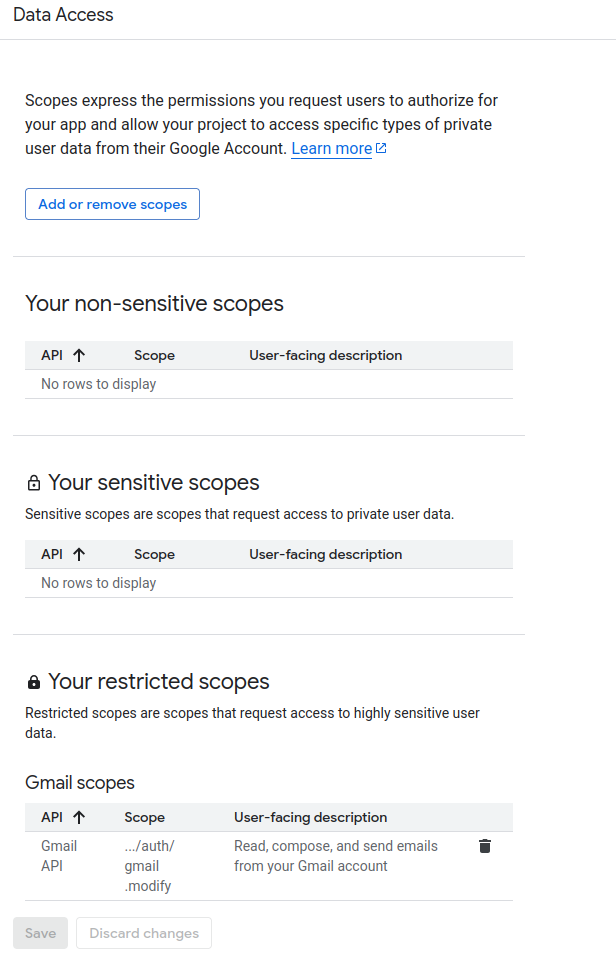

# Gmail Reader

A Python application that reads and processes Gmail messages using the Gmail API, stores them in a PostgreSQL database, and applies custom rules for email processing.

## Prerequisites

- Python 3.10 or higher
- Docker and Docker Compose
- A Google Cloud Platform account
- PostgreSQL (provided via Docker)

## Configuring Google API

1. Go to the [Google Cloud Console](https://console.cloud.google.com/)
2. Create a new project


3. Navigate to "APIs & Services" > "Library"
4. Search for "Gmail API" and enable it
5. Go to "Google Auth Platform" and configure the OAuth consent screen:
   - Select "Get Started" and fill in the required fields
   - Go to "Audience" tab and add test users (your email)


6. Go to "Clients" tab and click "Create Client":
   - Select "Desktop App" as the application type
   - Download the `credentials.json` file
7. Place the `credentials.json` file in the `creds` directory of your project
8. Go to "Data Access" tab and select "Add or Remove Scopes":
   - Add the scope `https://www.googleapis.com/auth/gmail.readonly`
   - Save the changes




## Setup and Installation

1. Clone this repository
2. Create and activate a virtual environment:
```bash
python -m venv .venv
source .venv/bin/activate  # On Windows use: .venv\Scripts\activate
```

3. Install dependencies:
```bash
pip install --upgrade pip
pip install wheel setuptools
pip install -r requirements.txt
pip install -e .
```

4. Set up the database:
```bash
docker compose up -d
```

5. Configure environment:
```bash
cp sample.env gmail_reader/.env
```

## Usage

1. View available commands:
```bash
cd gmail_reader
python main.py --help
```

2. Initialize the database:
```bash
python main.py init-db
```

3. Fetch emails:
```bash
python main.py update-mails --email "your.email@gmail.com" --creds-file creds/credentials.json
```

4. Process rules:

You can process rules using JSON files from the `rules` directory:

```bash
python main.py process-rules --rules rules/rules1.json
```

Example output:


Try another rule:
```bash
python main.py process-rules --rules rules/rules.json
```

Example output:


## Technical Details

- Database: PostgreSQL (containerized with Docker)
- ORM: SQLAlchemy
- API: Gmail API with OAuth2 authentication
- Architecture: Modular CLI application
- Configuration: Environment variables and JSON rule files
- Dependencies: Managed through pip and virtual environment

## Project Structure

```
gmail_reader/
├── creds/              # Store your credentials.json here
├── database/           # Database models and operations
├── gmail_service/      # Gmail API integration
└── rules/              # JSON rule definitions
```

## Problems with the implementation
- Memory issue as the number of emails increases
- The application may not handle large datasets efficiently due to the way it processes emails in memory.
- Transaction label update not implemented
